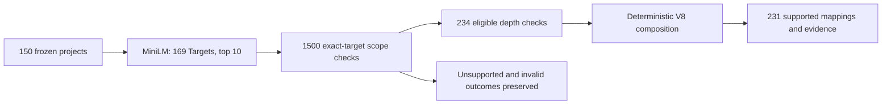

# CORDIS → UN SDG Target Mapping

An evidence-backed, multi-label mapping demonstration for 150 CORDIS projects. The app lets evaluators inspect frozen mappings, evidence and explanations; it does not run a model or classify new projects.

**231 supported mappings · 100 mapped projects · 50 with no supported top-10 target · 4 system-invalid cases retained separately.** HIGH=STRONG (88), MEDIUM=WEAK (143); DIRECT=188, INDIRECT=43. Confidence labels are categorical, not probabilities.



Every public row includes the project, exact target URI/wording, contribution, evidence segment IDs, source fields and explanation. Zero accepted mappings is allowed. Public evidence normalizes whitespace; source segments remain available for inspection.

## Run locally
Use Python 3.12, preferably a virtual environment:

```bash
python -m pip install -r requirements.txt
python tests/release_integrity_test.py
python -m streamlit run app/app.py
```

No API key or GPU is required. [The executed notebook](notebooks/final_analysis.ipynb) explains the method, recomputes results and regenerates five figures from frozen files. [Deployment instructions](docs/DEPLOYMENT.md) include notebook execution.

## Validation and limits
**V8 failed the complete internal development gate.** Reused GPT-5.4 Mini development results (240 pairs / 24 projects) are not independent final GPT-6 Luna accuracy. Production evaluated 169 Targets only; Indicator/Series concepts were not evaluated. The frozen prompt calls inputs Horizon Europe projects although 42 are OTHER (420 scope checks; 28 supported mappings). The 150-project demonstration does not estimate population prevalence. See [Validation](docs/VALIDATION.md) and [Limitations](docs/LIMITATIONS.md).

## Data and reproducibility
Source: CORDIS project data; taxonomy: retained EU Vocabularies SDG export. The exact original CORDIS download date is unavailable. [Methodology](docs/METHODOLOGY.md) records the processed source hash, final corpus strata, six privacy replacements, API settings and frozen prompt/schema/composer hashes. Local tests reproduce frozen-output lineage and composition. Missing final selection/retrieval orchestration code and provider variability limit end-to-end reproducibility. No inference was rerun for this release.

`data/` contains the frozen mapping CSV, all-project summary, invalid cases, workbook, privacy-clean corpus and taxonomy. `artifacts/` contains selected manifests, frozen responses, privacy-safe parsed composition inputs and verifier code. `app/`, `notebooks/`, `figures/`, `docs/` and `tests/` provide the evaluator workflow. The private research archive and raw API logs are excluded.

## Competition submission
See [Submission description](docs/SUBMISSION_DESCRIPTION.md). This release candidate now has a public Streamlit prototype at the URL below, as reported by the project owner. Public availability does not establish independently validated final-model accuracy. [License status](LICENSE_STATUS.md) requires the owner's decision and third-party attribution review before publication.

PUBLIC APP URL: https://cordis-sdg-target-mapping-jpqfdgzmtxorrcsshrq6pq.streamlit.app/


## Project Development Journey

A detailed account of the development process, technical challenges, validation decisions, limitations, and personal reflections from building this project is available here:

[Project Development Process and Personal Reflection](docs/PROJECT_DEVELOPMENT_AND_REFLECTION.md)
